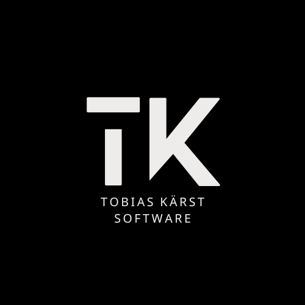

<h1 align="center">Tobias Kärst Software</h1>

   
    
   

Collection of projects created and maintained by Tobias Kärst 🌱

## Projects

### autoripper

_**[autoripper](https://github.com/tobias-kaerst-software/autoripper)**_ is an automatism for using MakeMKV and Handbrake to backup your owned (and DRM free) DVD or Blue-Ray Discs written purely in Rust. It is also integrated inside the Sonarr and Radarr media management software, which allows the software to automatically upload the media to your media server. And all of that gets controlled remotely via a modern web interface.

 

---
